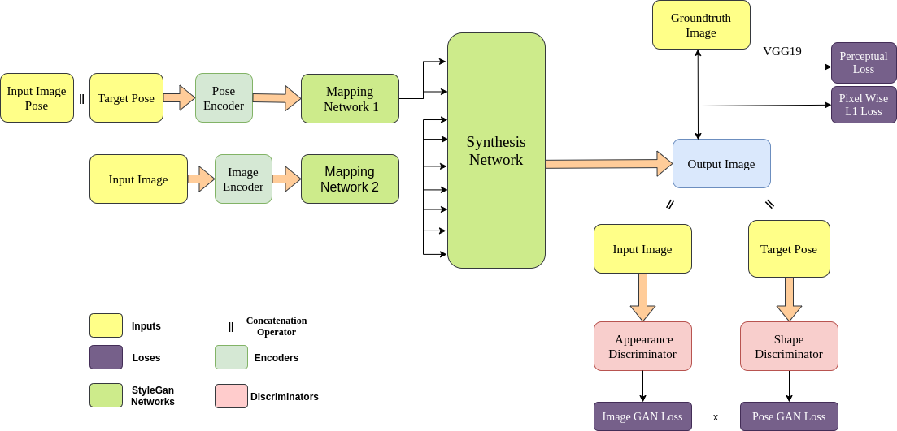
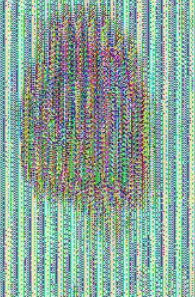
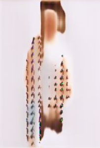
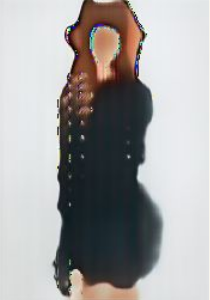
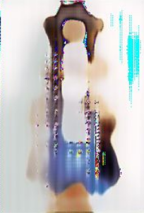
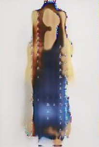

# Human Pose Transfer
In this project, we tried to tackle a core computer vision problem "Human Pose Transfer". Done as part of research project at IITB. 
## Team Members  
1) Parth Shettiwar
2) Prajval Nakrani
3) Rathod Harekrissna
4)Utkarsh Bhalode

#### Problem Statement  
Given a reference person image x and a target pose p , our goal is to generate a photorealistic image x’ for that person but in pose p. 

#### Our Contribution  
1)We leverage the recent StyleGan Architecture to solve the problem of Human Pose Transfer using appropriate loses as mentioned in Progressive Attention Transfer Paper  
2)We show qualitative results on the Deep Fashion Dataset to evaluate the performance of our Pose Transfer Network  

#### Network Architecture

Our main intuition was to understand the pose transfer problem as a style transfer proble. We adopted this architecture from [StyleGan](https://arxiv.org/pdf/1812.04948.pdf) and used the standard pose transfer loses from [Progressive Attention Transfer Mechanism](https://arxiv.org/pdf/1904.03349.pdf). Following are some of the results produced (Epoch1, Epoch11, Epoch19, Epoch24, Epoch32 in order) using this naive architecture and shows the idea is promising.

#### Results
    

